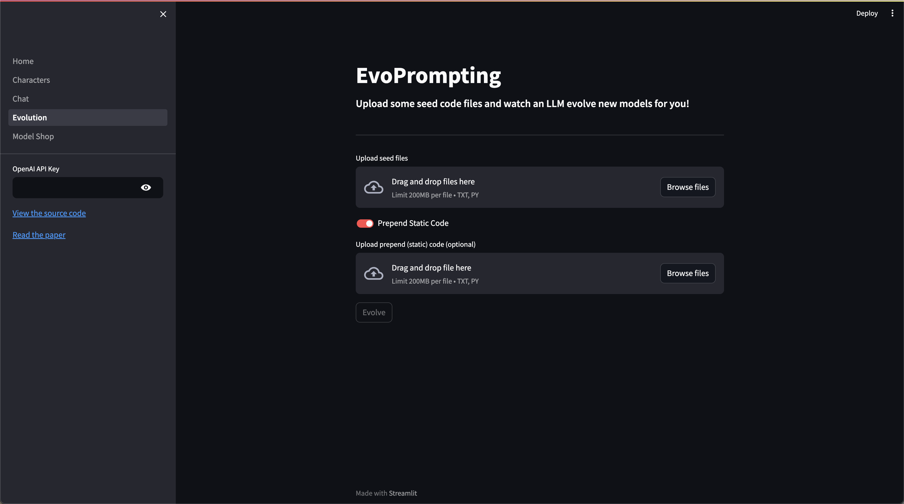

# CS 6220 Group 4 Project

# A Deep Dive into Evolutionary Neural Architecture Search, Compression and Synthetic Data Generation

## EvoFormer (EvoPrompting)

Our EvoFormer was implemented mostly from scratch, and the initial experimental code can be found in `evoprompting/evoprompting_new.ipynb`.

Apart from this, we have implemented EvoFormer both as a clean class implementation and a Streamlit-based GUI.

The EvoFormer class can be found in `evoprompting/evoformer.py`

To execute it on your system, we recommend using our custom GUI which provides an easy-to-use interface:

```
git clone https://github.com/karishmagrana/Big-Data-Final-Project
cd evoprompting
pip install -r requirements.txt
cd src
python -m streamlit run ui/Home.py
```



With the UI open, you simply upload your seed files (make sure they execute properly) and static prepend code (if you have any), enter your OpenAI API key and click Evolve.

## Synthetic Data Generation

Our Synthetic data and the scripts used to generate it can both be found in the `synthetic_data` directory.

With the base Climate-FEVER dataset being approx 7000 data points in size, we generated a total of 3000 new datapoints - thus extending the original dataset's size by over 42%.

## Pruning

## Quantization
